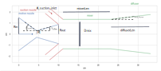
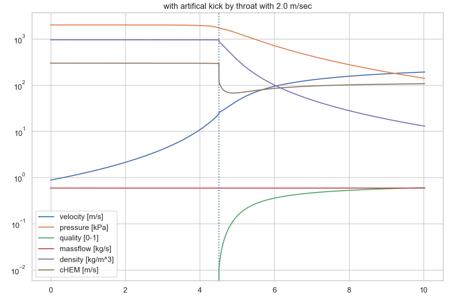
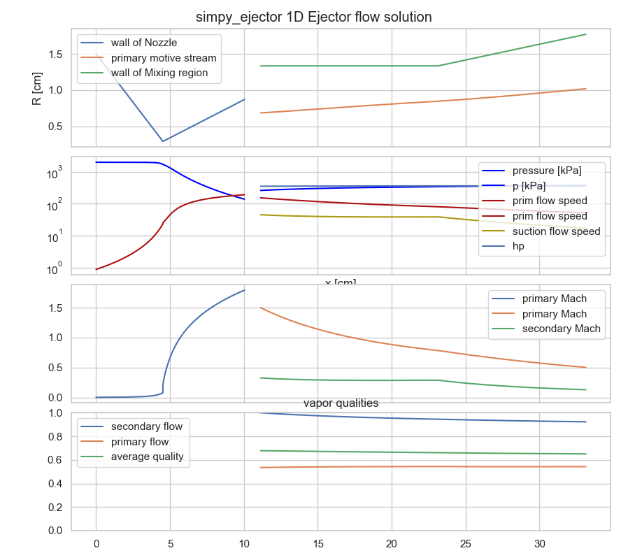
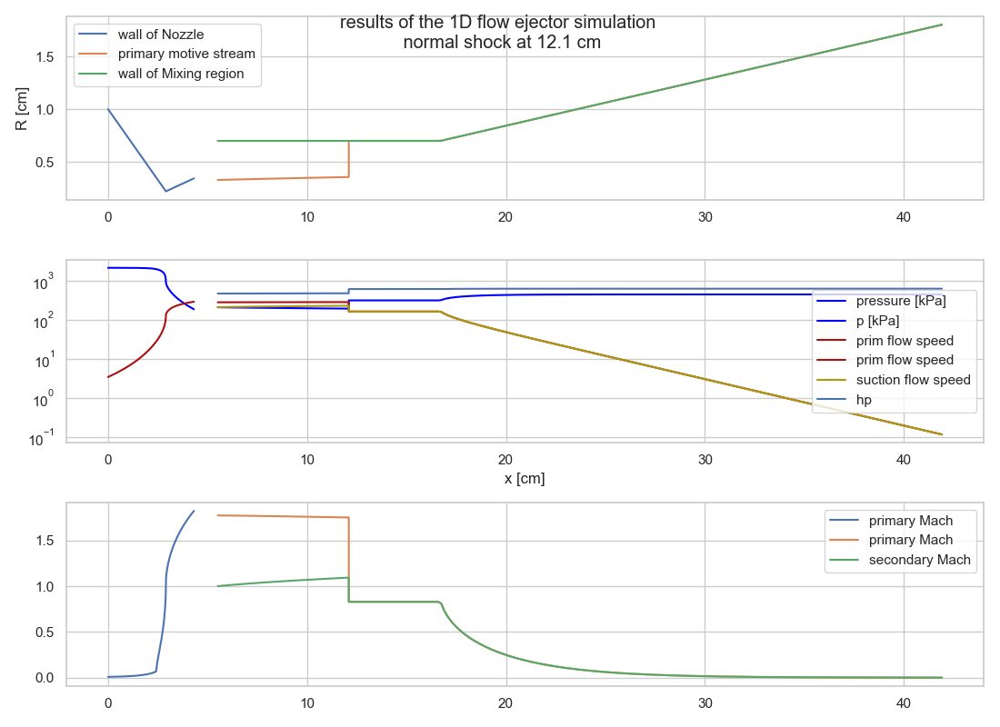
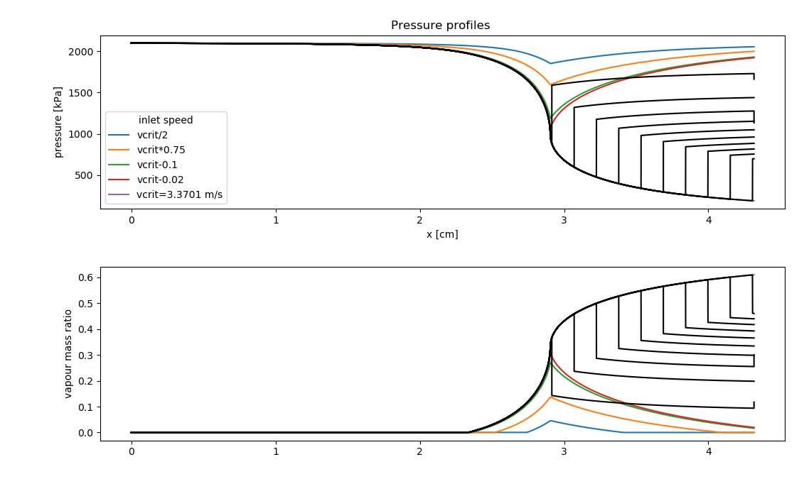
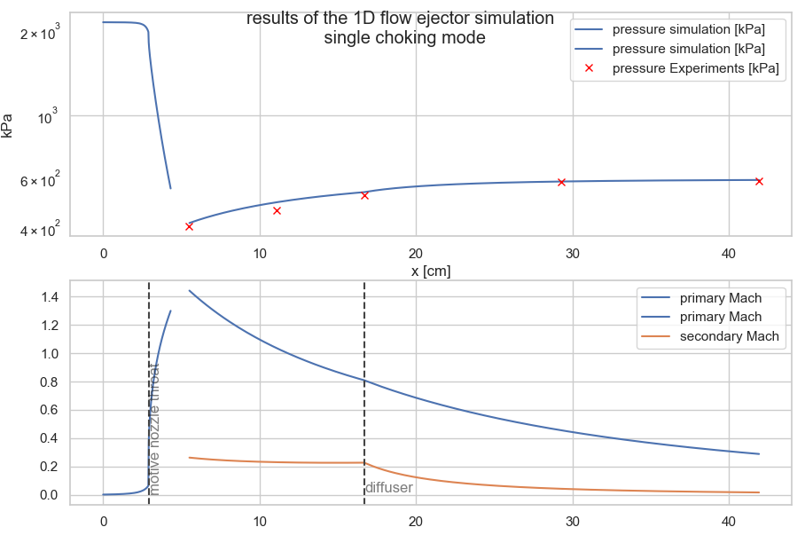

# The *simpy_ejector* python package

## fast 1 dimensional python simulator for ejectors

A 'simple' and fast 1 dimensional computational fluid dynamics simulator
made for simulating Ejectors for heat pump and
refrigerator applications. It includes modules for
simulating two phase supersonic nozzles, that are crucial parts
of supersonic ejectors.

Using this package you can easily calculate mass flow-rates of motive and suction nozzles of ejectors with 
the user defined ejector geometry and fluid specification. 
The provided functions solve simplified differential-algebraic equations of the fluid flow (mass, momentum and energy equations).
This package calculates and plots speed, pressure, quality, etc. profiles along the ejector axis. 
And lets you easily calculate ejector efficiency. 

You can play with the primary nozzle and ejector geometry, and update the calculation results with any fluid from the 
Refprop (https://www.nist.gov/srd/refprop) library. This makes it an ideal tool for a rough and fast ejector dimensioning.
You can calculate and evaluate with ease dozens of ejector geometries within minutes. And you know it, that it replaces hours and days 
of heavy calculations on commercial software packages!

This module can be used for 1 component, one or two phase flow simulations.
In the first version it applies the homogeneus equilibrium model (HEM) to calculate
material properties. (For the thermodynamic properties it needs the RefProp 9 or newer to be installed - not tested for older versions)  


For a short description of the method see the pdf in the Docs directory: 
[/Docs/](./Docs/Ejector_Buruzs.pdf) <br>
The english description of the method will be published soon, and you must reference to it if you use this package in any publication! 


To see, how it works, look into the jupyter notebooks located in the directory:
[src/simpy_ejector/useCases/](./src/simpy_ejector/useCases/EjectorMixerSingleShocking.ipynb)

Don't forget, that flows1d requires you to install the python-Refprop package ctREFPROP:
https://pypi.org/project/ctREFPROP/.
In windows you need to have the refprop.dll installed (for the development I have used version 9.1)
and set the environment variable 'RPprefix' to the path of the 'refprop.dll' file. 
For example if your REFPROP is installed into "C:/Program Files (x86)/REFPROP/", then open a command window, and type:
```
setx RPprefix "C:/Program Files (x86)/REFPROP/"
```
(or set the RPprefix user-environment variable  through windows menu)

**For the latest Documentation, Demo, Tutorials and Examples visit the project page on github:
https://github.com/AdamBuruzs/simpy_ejector**

## Installation
Only tested on Windows. ( Linux installation manual is still to be done. )

````
pip install simpy-ejector
````
And set the environment variable 'RPprefix' to the path of the 'refprop.dll' file. 
For example : "C:/Program Files (x86)/REFPROP/"

Test if refprop is setup and working correctly, start a python shell, and write:

````
>>> from simpy_ejector import refProp
>>> RP = refProp.setup("water")
>>> out = refProp.getDh_from_TP( RP, T=350, p = 100)
>>> print(f'water at 300K and 100 kPa : Density = {out[0]} kg/m3, spec enthalpy = {out[1]} kJ/kg')
````
You should get a result of 996.5 kg/m3 and 112 kJ/kg. If you get an error, then check your refProp installation, and 'RPprefix' environment variable settings.

## Quickstart guide

After installation you can import the package. In the simpy_ejector.useCases.ejectorSimulator module you find a class that helps you very quickly setting up and performing a simulation of an ejector. So simply write into a python file:

````
import logging
import sys
logging.basicConfig(stream = sys.stdout, level = logging.INFO)
import matplotlib.pyplot as plt
import pandas as pd
from simpy_ejector.useCases import ejectorSimulator
from simpy_ejector import refProp
````

Then set the fluid (refrigerant), that you want to use in your ejector. For example:

````
# load Refprop for your fluid:
fluid = "R1233zd"
RP = refProp.setup(fluid)
````

Then specify the ejector geometry:
```
# set up geometry parameters:
params = { "Rin": 1.5, "Rt": 0.29, "Rout": 0.87, "gamma_conv": 15.0, "gamma_div" : 6.0, "Dmix": 2.67,
           "Pprim": 2007, "hprim" : 365.5, "hsuc": 437.1, "Psuc" : 276.3 , "A_suction_inlet" : 16 ,
           "mixerLen": 12 , "gamma_diffusor": 2.5, "diffuserLen": 10}
```

Use this picture to find the meaning of the parameters: <br>


The parameter units:

| parameter | description | unit
|---- | ---| ---
| Rin | primary nozzle inlet radius in | cm
|Rt| primary nozzle throat radius in| cm
|Rout| primary nozzle outlet/exit radius in| cm
|gamma_conv| primary nozzle convergent part angle| degree
|gamma_div| primary nozzle divergent part angle| degree
|Dmix| mixer diameter (2*radius) in| cm
|Pprim| primary nozzle inlet pressure in| kPa - kiloPascal
|hprim| primary nozzle inlet specific enthalpy | kJ/kg
|hsuc| secondary/suction nozzle inlet specific enthalpy | kJ/kg <br>
|Psuc| secondary nozzle inlet pressure in| kPa - kiloPascal
|A_suction_inlet| primary nozzle inlet cross section area| cm<sup>2</sup> <br>
|mixerLen| length of the mixer| cm <br>
|gamma_diffusor| angle of the diffuser profile in| degree <br>
|diffuserLen| length of the diffuser| cm <br>

Then calculate Temperatures from specific enthalpy with Refprop:

```
primQ = refProp.getTD(RP, hm= params["hprim"], P=params["Pprim"] )
params["Tprim"] = primQ['T']
params["Tsuc"] = refProp.getTD(RP, hm= params["hsuc"], P=params["Psuc"] )['T']
```

set parameters of the mixing calculations:
```
params["mixingParams"] = {'massExchangeFactor': 2.e-4, 'dragFactor': 0.01, 'frictionInterface': 0.0,
                        'frictionWall': 0.0015}
```

create a simulator object:
```
esim = ejectorSimulator.ejectorSimu(params)
```
 plot the ejector geometry:
```
ejplot = esim.ejector.draw()
```
This line will create for you an interactive *matplotlib* plot of your ejector

```
## calculate the primary mass flow rate:
esim.calcPrimMassFlow()
```
This will iteratively calculate the critical inlet velocity, where the motive nozzle chokes. The critical speed and mass flow rate will be printed on the standard output

calculate the critical (= choked flow) solution in the motive nozzle:
```
res_crit = esim.motiveSolver()
print(f"By the motive nozzle exit:\n {res_crit.iloc[-1]}")
```
You will see the chart with the motive nozzle flow, the velocity, quality and pressure plotted in the motive nozzle 

 solve the pre-mixing equations:
```
esim.premix(res_crit) # this sets the mixer, that is needed for the mixing calculation
print(f"suction MFR [g/s] {round(esim.mixerin['massFlowSecond'],3)}")
```
 solve the mixer equations until the ejector outlet
```
esim.mixersolve()
  
  ```
Let it calculate the mass-flow rates and checks:
```
esim.massFlowCheck()
outletValues = esim.solMix.iloc[-1].to_dict() # .transpose()

average_h = (outletValues["MFRp"] * outletValues["hp"] + outletValues["MFRs"] * outletValues["hs"])/ (outletValues["MFRp"] + outletValues["MFRs"] )
print(f"Ejector outlet specific enthalpy {round(average_h,3)} kJ/kg, pressure {round(outletValues['p']*1e-2,3)} bar,"
      f" vapor quality {round(outletValues['q_average'],3)}  ")

esim.plotMixSolution(res_crit, esim.solMix, "simpy_ejector 1D Ejector flow solution")
```
You get an interactive *matplotlib* chart, so you can zoom in to see the values.


The pressure and specific enthalpy is printed at the ejector exit. <br>
That's it, you have performed your first ejector simulation with **simpy_ejector** ! 


## Examples

simulation result for an ejector (with a simulated normal shock wave)


Pressure profiles in a nozzle with a simulated shock-wave.


Pressure profile comparison with experiment (in this case without shock-waves):

